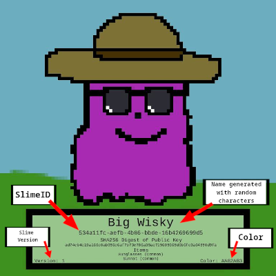

# Authslime	

A CLI tool that allows you to create cryptographic slime with fun attributes! It supports a local SQLite database which stores all information. 

Creates an Authslime:
 1. Creates Attributes of the Slime (ID, KeyID, Version, Name, Color, Template, and Accessories)
 2. Crypto actions (Create keypair, CSR, Issues X.509 Certificate, KeyWrapping)
 3. Creates Slime Picture, containing Attributes
 4. Inserts data(Slime attributes/certs/keys/picture) into a local Database (SQLite)
 5. Optional actions such as read actions / stats and graph for creation

According to the RNG, accessories will be chosen for the authslime (up to two). There are common, uncommon, and rare accessories. 

| Rarity    | Item |
| -------- | ------- |
| Common   | sunglasses, sunhat    |
| Uncommon | top hat, wizard hat, mustache     |
| Rare     | robin hood hat, santa hat, crown, golden top hat, golden sunglasses    |




## Table of Contents

- [Installation](#installation)
- [Usage](#usage)
- [Examples](#examples)
- [Design](#design)

## Installation

This tool performs many cryptographic actions(key wrapping, issuing X.509 Certificates). This requires:

1) RSA Keypair 
`keys/publickey.pem` - used to encrypt the wrapping key that wraps the authslime's private key
`keys/privatekey.pem` (optional) if you wish to decrypt the authslime's private key

1) Your Certificate authority(CA) keypair and certificate
`ca/private/ca.key` - The private key associated with your CA used for signing the authslime certificates
`ca/certs/ca.pem` - The CA certificate

**If you don't care about this, and just want to test out the script, you can run ```quickcryptosetup.sh```. It is a bash script that creates the nessesary files.

``` sh quickcryptosetup.sh```

For the rest of the dependancies, you can run:

```pip install -r requirements.txt```


## Usage

    usage: authslime.py [-h] -n NUMBER [-g] [-v] [-r] [-i]
      
    options:
      
      -n NUMBER, --number NUMBER (required)
                            Define how many authslime you would like to create
      -g, --graph           Pass this if you would like to view a graph
      -v, --verbose         Print authslime information and creation times
      -r, --rare            Rare Detector: prints message when a rare item/color is created
      -i, --images          Prints the authslime image in the img/ directory
	    -h, --help            Show this help message and exit

## Examples

1) Create 10 authslime, displaying a graph to show their creation times.

    `python3 authslime.py -n 10 -g`

2) Create 15 authslime, being verbose to see them get created

    `python3 authslime.py -n 15 -v`

3) Create 20 authslime, printing when there's a rare item,  while showing a graph

    `python3 authslime.py -n 20 -r -g`

4) Create 100 authslimes and Enable all!

    `python3 authslime.py -n 100 -g -v -r -i`

## Design

Cryptographic operations - Each Authslime gets an X.509 certificate issued by the referenced CA (`ca/` directory). After issuance of the X.509 certificate, the associated Authslime private key gets wrapped (encrypted) by a symmetric key, using the local source of entropy. The wrapping symmetric key gets encrypted by the keypair (`keys/publickey.pem`).

```
Keypair (keys/publickey.pem) 
       |
       | (Encrypts)
       V
     SymKey	  
       |
       | (Encrypts)
       V
PrivateKey(Assocaited with the AuthslimeCert)
```
	  
	1) Create Symmetric Key, IV
	2) Encrypt Slime Private Key with Symmetric Key = wrappedprivatekey
	3) Encrypt Symmetric Key with Public Key = wrappedsymkey
	4) Store wrappedsymkey and wrappedprivatekey (Also aad/tag/iv)
 To decrypt, use ```keys/privatekey.pem``` to decrypt symmetric key. 
 Use symmetric key to decrypt wrappedprivatekey. This is shown in the function ```decrypt_test()``` in ```x50slime.py``` 

After image creation, this information gets put into the local SQLite database. 

    +-------------------+        +-------------------+		  
    |       Slime       |        |       Keys        |
    +-------------------+        +-------------------+		 
    | Slime ID (PK)     |        |                   |        
    | KeyID (FK)        | -----> | KeyID (PK)        | 
    | Version           |        | WrappedPrivateKey |       
    | Name              |        | PublicKey         |        
    | Color             |        | Certificate       |		  
    | Template          |        | WrappedSymKey     |
    | AuthslimeImage    |        | IV                |
    +-------------------+        | AAD               |
                                 | Tag               |
             ^                   +-------------------+
             |
    +-------------------+  
    |    Accessories    |
    +-------------------+  
    | SlimeID (FK)      | 
    | AccessoryName     |
    +-------------------+ 

Here is a diagram of the flow:


